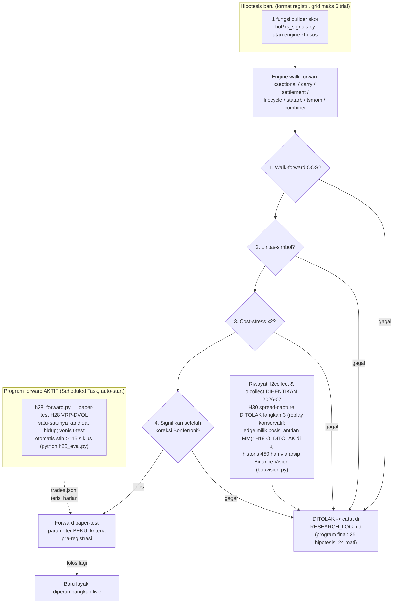

# Binance USDC-M Futures Bot

Bot trading futures USDC-margined di Binance dengan arsitektur 7-layer:
**data → screening → smart rotate → signal engine → risk gate → execution → position management**, plus **agen ReAct** yang mengelola keputusan entry (gate aktif, pelajaran, evolusi threshold tervalidasi OOS) — menggantikan veto Gemini pasif. Lihat **[AGENT.md](AGENT.md)**.

Satu basis kode, **tiga mode** lewat satu variabel `MODE`:

| MODE | Arti | Uang |
|---|---|---|
| `dry` | Data pasar **nyata**, order **disimulasi** di memori. Tanpa API key. | — |
| `test` | Binance **Futures Testnet**. API real, saldo palsu. | palsu |
| `live` | Akun Binance asli. | **NYATA** |

---

> **Artefak utama proyek ini = [METHODOLOGY.md](METHODOLOGY.md)** (asumsi, batasan,
> temuan, cara reproduksi). Nilai di sini adalah *sistem pengujian yang jujur & reproducible*,
> bukan klaim profit. Pada data yang dapat di-backtest, **tidak ditemukan edge tradeable** —
> dan itu didokumentasikan, bukan disembunyikan.

## ⚠️ Baca dulu — jujur soal ekspektasi

- **Tidak ada bot yang menjamin "win rate tinggi" atau "profit konsisten tiap hari."** Yang dirancang di sini adalah *survival* (tidak blow-up) + *expectancy positif* lewat risk/reward dan disiplin eksekusi. Akan ada hari/minggu merah — itu normal dan sudah diantisipasi lewat circuit breaker.
- **Gemini bukan mesin sinyal.** LLM lambat & tidak unggul membaca indikator numerik. Di sini Gemini **mengelola keputusan** (gate entry ReAct, pelajaran, evolusi threshold) — bukan memprediksi sinyal. Otak entry tetap rules deterministik, dan **kegagalan LLM tak pernah memblokir trading** (fallback deterministik). Detail: [AGENT.md](AGENT.md).
- **Wajib lulus `test` dulu.** Jalankan di testnet berhari-hari, cek `logs/trades.jsonl`, baru pertimbangkan `live` dengan modal kecil.
- **Risiko 100% milikmu.** Ini perangkat lunak, bukan nasihat keuangan.

---

## Setup

```bash
pip install -r requirements.txt
cp .env.example .env        # lalu isi sesuai mode
```

### Mode dry (langsung bisa, tanpa key)
```bash
# .env -> MODE=dry
python run.py --check       # cek koneksi + universe
python run.py --once        # satu tick
python run.py               # loop penuh (simulasi)
```

### Paper (forward-test) — pakai `MODE=dry`
> ⚠️ **Binance Futures Testnet sudah DEPRECATED** (ccxt tak lagi mendukung sandbox futures).
> `MODE=test` kini otomatis = **paper di data LIVE** (sama dengan `dry`, order disimulasi).
> Untuk paper/forward-test, gunakan **`MODE=dry`** — tanpa API key, data live nyata.

### Mode live (uang nyata)
1. API key Binance: **aktifkan Futures saja**, **matikan withdrawal**, **kunci ke IP server**.
2. `.env` → `MODE=live`, isi `BINANCE_LIVE_KEY/SECRET`.
3. Mulai dengan `risk.account_risk_pct` kecil & `leverage` rendah di `config.yaml`.

---

## Cheatsheet — komponen & perintah

| Perintah | Fungsi |
|---|---|
| `python run.py` | Engine mono Python (riset cepat, strategi v1) |
| `python backtest.py --bars 1500` | Backtest expectancy (R, fee+slippage, no-lookahead) |
| `python optimize.py --strategy v4 --bars 3500` | Sweep + walk-forward (verdict OOS) |
| `python optimize.py --strategy v5 --copilot` | Riset edge struktural (cross-exchange basis) + **Gemini co-pilot** ([RESEARCH.md](RESEARCH.md)) |
| `python forwardtest.py --poll 30 --use-store` | Forward-test paper di data live (diatur dari UI) |
| `python dashboard.py` | Dashboard web (React/Vite + SQLite): status per-pair, chart, kontrol, riwayat, token Gemini → `:8000` ([DASHBOARD.md](DASHBOARD.md)) |
| `cd web && npm run build` | Build frontend React/Vite (dashboard menyajikan `web/dist`) |
| `python chart_ingest.py --all-usdc` | Isi/refresh chart OHLCV → SQLite `data/market.db` (backfill otomatis) |
| `python sl_calibrate.py` | Kalibrasi lantai SL dari 1 thn data (MAE pemenang, ×ATR) |
| `python h28_eval.py` | Progres/vonis t-test paper-test H28 (PREVIEW s/d 15 siklus) |
| `python ab_report.py` | A/B: apakah layer agen (ReAct/rem) menambah nilai — diukur |
| `pytest -q` | 113 unit test Python (termasuk anti-leakage, signifikansi, gerbang verdict) |
| `cd core && cargo test` | 8 unit test Rust (hot-path) |
| `docker compose up -d --build` | Deploy bot + collector + dashboard 24/7 |

**Dokumentasi:** [METHODOLOGY.md](METHODOLOGY.md) (asumsi/batasan/temuan) ·
[RESEARCH.md](RESEARCH.md) (loop riset edge struktural + **Gemini co-pilot**) ·
[RESEARCH_LOG.md](RESEARCH_LOG.md) (log tiap hipotesis) ·
[GEMINI_TRADER.md](GEMINI_TRADER.md) (**Gemini praktisi trader** ber-memori & refleksi) ·
[DASHBOARD.md](DASHBOARD.md) (dashboard web + SQLite + setting UI) ·
[DEPLOY.md](DEPLOY.md) (Proxmox/Debian) · `core/README.md` (Rust core).

### Update 2026-07-02 — pengerasan utk tujuan "aset terus naik" (live-mikro)

| Fitur | Detail | Kontrol |
|---|---|---|
| Isolasi per-mode | saldo/posisi/jurnal/decision-log dry-test-live TERPISAH (anti kontaminasi; termasuk saat switch mode runtime) | otomatis |
| Mode switch | `mode` tak bisa diubah form biasa; form basi tak bisa menimpa | `GET/POST /api/mode` |
| Screener Layer 2 di jalur forward | volume ≥$5jt + spread ≤0.03% + ATR 0.25–6%, cache 15 mnt, fail-open | `config.yaml: screener` |
| Prefilter volume (penyaringan pertama) | universe besar (>80 pair) disaring SATU batch `fetch_tickers`; **SEMUA** pair ≥ ambang volume lanjut ke screen detail, TANPA batas top-N rangking (dulu terpotong top-60, membuang pair likuid yg kalah rangking) | `screener.prefilter_volume(top_n=None)` |
| Kuota Gemini per-siklus | screener+pre-gate TETAP gratis-Gemini (rules lokal); tapi berapa BANYAK simbol yg lanjut ke Gemini dlm SATU siklus dibatasi — restart/universe besar tak lagi memicu ledakan panggilan serentak (dulu: SEMUA simbol "bebas panggil" bareng krn `_last_decide` kosong saat boot → 429 bertubi + `_monitor_usd` simbol lain tertunda) | `config.yaml: gemini.gemini_decide_budget_per_cycle` (default 8) |
| Drawdown lock TOTAL | entry terkunci bila saldo turun ≥20% dari puncak (persisten, tahan restart); CB harian tetap ada | lepas: `POST /api/dd-reset`; ambang: `max_drawdown_pct` |
| Lantai jarak SL (kalibrasi data) | min = max(**1.75×ATR**, 0.5×range candle terakhir) — dari studi 1 thn ×15 pair (~325rb pemenang, q80); berlaku utk SL rule & Gemini | `data/sl_calibration.json` + kv `sl_calibration` |
| Data exit utk Gemini | MFE/MAE + alasan exit per trade → jurnal, decision log, tabel Gemini; `setup_stats` punya sl_hit_rate & MFE-sebelum-SL | otomatis |
| Funding sim di paper | posisi menginap (00/08/16 UTC) diakru & dipotong dari PnL → expectancy jujur | otomatis (live: exchange yg motong) |
| Aturan compounding | `bet_pct` hanya boleh >0 stlh ≥30 trade live + expectancy_r>0 + tanpa dd-lock (addendum #2 registri) | `curl /api/stats` |
| API baru | `/api/candles` (chart dari SQLite), `/api/h28` + `/api/h28/toggle`, `/api/mode`, `/api/dd-reset`; NaN/inf disanitasi | — |

**Gemini (opsional):** isi `GEMINI_API_KEYS` + `GEMINI_ENABLED=true` di `.env` →
mengaktifkan regime veto & news veto (`config.yaml: gemini.news_veto`) **dan
strategy co-pilot riset** (`--copilot`, lihat [RESEARCH.md](RESEARCH.md)). Tanpa key →
non-aktif (veto allow, co-pilot pakai interpretasi deterministik).

---

## Backtest dulu (wajib sebelum live)

```bash
python backtest.py --symbols "BTC/USDC:USDC" --bars 3000 --tf 15m
python backtest.py --bars 5000 --csv trades.csv     # semua whitelist + dump
```

Metrik kunci = **`exp_R`** (expectancy per trade dalam kelipatan risiko, sudah
termasuk fee+slippage, tanpa lookahead). `exp_R > 0` = ada edge.

> Status default saat ini: **`exp_R ≈ -0.19` (BELUM ada edge).** Parameter di
> `config.yaml` adalah titik awal, bukan strategi jadi. Jangan jalankan `live`
> sampai backtest (idealnya walk-forward) menunjukkan expectancy positif yang stabil.

### Sweep + walk-forward (anti-overfit)

```bash
python optimize.py --symbols "BTC/USDC:USDC" --bars 5000 --train 1000 --test 300
```

Memilih parameter terbaik di data **train**, lalu mengujinya di data **test**
yang belum dilihat, lalu menggeser jendela maju. Verdict = expectancy **OOS**.

> Temuan saat ini: in-sample selalu positif tapi **OOS ≈ −0.21R** → klasik
> **overfitting**. Pelajaran: edge harus datang dari *fitur sinyal yang benar*,
> bukan dari tuning angka. Inilah pengaman utama sebelum membuang uang live.

## Collector L2 orderbook (riset microstructure)

Kumpulkan snapshot depth orderbook — data yang **tak tersedia historis** dari exchange,
jadi harus direkam forward (sekali terlewat, hilang).

```bash
python l2collect.py --symbols "BTC/USDC:USDC" --levels 10 --interval 1
```

Output `data/l2/<symbol>_<tanggal>.jsonl.gz` (~50–200 MB/hari/pair). Tiap baris =
snapshot raw (depth N level) **plus** fitur turunan (imbalance, micro-price, spread).

> Catatan rate-limit: REST-poll banyak simbol/cepat bisa kena ban IP (418) — Binance
> menyarankan WebSocket untuk skala (lihat `bot/l2.py`). Untuk beberapa simbol @ ≥1s aman.

## News veto (Gemini, real-time)

Veto entry saat ada berita high-impact (FOMC/CPI, regulasi, hack, delisting). Headline
dari RSS publik (CoinDesk/Cointelegraph, tanpa API key) → Gemini menilai → `{veto, note}`.

```env
GEMINI_ENABLED=true
GEMINI_API_KEYS=key1,key2
```
Lalu di `config.yaml`: `gemini.news_veto: true`. Aktif di forward-test.

> Jujur: ini **real-time, TIDAK bisa di-backtest** (tak ada histori headline berlabel).
> Gunanya menambah **keamanan** (hindari trading saat chaos berita), **bukan** bukti edge.
> Gagal jaringan/Gemini → otomatis *allow* (tak pernah blokir trading karena error infra).

## Forward-test (paper, data LIVE) — langkah sebelum mempertimbangkan uang

```bash
python forwardtest.py --once                 # uji satu siklus
python forwardtest.py --poll 30              # jalan terus (Ctrl+C berhenti)
python forwardtest.py --symbols "BTC/USDC:USDC" "ETH/USDC:USDC"
```

- **Data live nyata, eksekusi paper** (tanpa uang). Akuntansi identik backtest (fee+slippage).
- **Parameter TETAP** selama jalan — TIDAK re-optimize (re-optimize sambil jalan = menipu diri).
- Tiap trade dicatat ke `logs/forward_trades.jsonl` dengan R-multiple; statistik berjalan
  (win%, expectancy R, equity) tercetak tiap siklus.

> Cara pakai jujur: jalankan **berhari-hari/minggu** di beberapa pair. Bila `expectancy R`
> tetap **> 0** pada sampel besar (puluhan+ trade) di data yang belum pernah dilihat,
> barulah ada bukti edge. Bila ~0 atau negatif (seperti backtest), **jangan live.**
> Catatan: Binance Testnet sering tak punya pair USDC & harganya tak realistis, jadi
> paper-on-live-data ini lebih sahih untuk menilai edge daripada order di testnet.

## Deploy (Docker) — bot + dashboard 24/7

```bash
docker compose up -d --build      # jalankan bot (forward-test) + dashboard
docker compose logs -f bot        # pantau log bot
# dashboard: http://<host>:8000
docker compose down               # stop
```

- Dua service dari satu image; berbagi volume `./logs` (bot menulis jurnal, dashboard membaca).
- `restart: unless-stopped` → otomatis hidup lagi bila crash/reboot.
- Default `MODE=dry` (forward-test paper, tanpa API key). Ganti via `MODE=test docker compose up -d`.
- Cocok untuk VPS kecil mana saja (lihat catatan deploy: hindari serverless untuk proses always-on).
- **Proxmox / server lokal (Debian, DNS 1.1.1.1): lihat [DEPLOY.md](DEPLOY.md).**

## Panel kontrol di dashboard (atur dari UI)

Dashboard punya **Kontrol Bot**: atur dari browser, bot menerapkannya tiap siklus
(hot-reload via `logs/runtime.json`). Jalankan bot dengan `--use-store`:

```bash
python forwardtest.py --poll 30 --use-store    # baca pengaturan UI
python dashboard.py                            # atur di http://127.0.0.1:8000
```

Yang bisa diatur: **Status ON/OFF**, **Teknik** (`scalping` 5m · `swing` 1h · `auto`
= smart autopilot 15m + regime trend/mean-reversion), **Pair**, **Leverage**, **Bet/margin
(USD)**, **Saldo**, **Target profit %**. Sizing = `bet × leverage`, dengan **simulasi
likuidasi jujur**.

> ⚠️ **PERINGATAN LEVERAGE (ditampilkan juga di UI).** Leverage tinggi = judi, bukan trading.
> Pada **x100**, gerakan melawan **~0.5%** sudah **likuidasi** (modal habis) — dan SL berbasis
> ATR biasanya lebih lebar, jadi posisi kena likuidasi **lebih dulu**. Ini matematika, bukan
> pendapat. "Smart autopilot" **bukan** mesin profit: backtest strategi ini masih **impas**.
> Forward-test ini paper (uang palsu) — tempat aman untuk **melihat sendiri** x100 kena
> likuidasi tanpa kehilangan uang nyata.

## Dashboard monitoring (web)

```bash
python forwardtest.py --poll 30 --use-store   # terminal 1: bot (diatur dari UI)
python dashboard.py --host 0.0.0.0             # terminal 2: http://<host>:8000
```

Fitur (auto-refresh 10 dtk):
- **Kartu**: trades · liquidations · win% · expectancy R · profit factor · equity · return
- **Kurva equity** (dot merah di titik likuidasi) + **trade terakhir** (baris likuidasi merah)
- **Akun / API**: mode, saldo (live/paper), **validasi API key dari form**, status Gemini, **Test Telegram**
- **Status Bot**: ON/OFF, teknik, TF, leverage, saldo, posisi, news veto
- **Gemini Trader** (teknik "gemini"): track record + verdict signifikansi, per-setup, playbook teruji, keputusan terakhir ([GEMINI_TRADER.md](GEMINI_TRADER.md))
- **Aktivitas per Pair**: harga · ATR% · sinyal (LONG/SHORT/skip) · posisi+PnL · **alasan tak-entry** · tombol **Close** / **Close All**
- **Chart per pair**: candlestick multi-TF (5m/15m/1h/4h) + **EMA** overlay + panel **RSI** + garis entry/SL/TP/LIQ
- **Riwayat Trade**: filter pair/reason/tanggal + **export CSV**
- **Panel Kontrol**: teknik (scalping/swing/auto) · leverage · bet · saldo · target profit (hot-reload)

Komunikasi via file (aman, proses terpisah): bot menulis `logs/status.json` + `logs/trades.jsonl`;
UI menulis `logs/runtime.json` (pengaturan) + `logs/close_requests.json` (perintah close).

## Konfigurasi (`config.yaml`)

Semua strategi & batas risiko ada di sini — tidak ada angka ajaib di kode.
Yang paling penting untuk keselamatan:

- `risk.account_risk_pct` — risiko per trade (% equity). Mulai 0.3–0.5.
- `risk.daily_max_loss_pct` — **circuit breaker**: berhenti trading hari itu.
- `risk.leverage` — konservatif. Naikkan sangat hati-hati.
- `risk.sl_atr_mult` / `tp_atr_mult` — jarak SL/TP berbasis ATR (RR > 1).
- `rotate.max_open_positions` — slot posisi paralel.
- `gemini.pregate_atr_pct` — lantai pre-gate teknik Gemini (default 0.25): Gemini hanya
  ditanya bila ATR% ≥ ini (pasar cukup hidup). **ARAH diserahkan ke Gemini**, bukan disaring
  rules lama. Turunkan bila sinyal terlalu langka; naikkan bila panggilan/token boros.
- `gemini.planner_min_trades` — lantai "Kuota trade" sesi planner (default 3): planner tak
  boleh mencekik di bawah ini kecuali `stance=risk_off`. Tetap di-clamp ≤ `risk.daily_max_trades`.

---

## Arsitektur (peta ke modul)

### Alur kerja bot per siklus (forward-test / live)

Prinsip desain: **LLM = rem, bukan gas** — sinyal datang dari kode; lapisan AI
hanya bisa MENAHAN entry, dan setiap gerbang fail-open (error infra ≠ blokir).

```mermaid
flowchart TD
    EX["Binance USDC-M<br/>OHLCV + funding + orderbook"] --> SCR["Screener 4-metrik (Layer 2)<br/>volume 24h + spread ≤0.03% + ATR<br/>cache 15 mnt — buang pair mahal"]
    SCR --> LOOP["Loop per simbol<br/>bot/forward.py — hot-reload setting UI"]

    LOOP --> SIG["Signal engine<br/>bot/signals.py :: evaluate<br/>EMA/ADX/RSI + HTF + regime + funding + CVD"]

    subgraph GATES["Gerbang REM — semuanya bisa memblokir, tak ada yang membuka"]
        NEWS["News veto<br/>bot/news.py — Gemini + RSS<br/>cache 15 mnt, fail-open"]
        CB["Circuit breaker HARIAN<br/>max loss % / max trades"]
        DDL["DRAWDOWN LOCK total<br/>≥20% dari puncak saldo — persisten,<br/>lepas HANYA manual /api/dd-reset"]
        BTCG["BTC dominance gate<br/>bot/altdata.py :: btc_gate_side<br/>blok entri LAWAN arah BTC"]
        VRP["Rem-VRP (shadow)<br/>bot/vrp.py — gap DVOL−RV30;<br/>enforce hanya bila terbukti A/B"]
        DA["Devil's Advocate<br/>bot/react_agent.py<br/>debat adversarial tiap ENTER"]
        PLAN["Session planner<br/>kuota & bias sesi"]
    end

    SIG --> GATES
    GATES -->|semua lolos| DEC{"Teknik GEMINI aktif?"}
    DEC -->|ya| GT["GeminiTrader<br/>arah + SL/TP dari LLM<br/>level DIVALIDASI kode"]
    DEC -->|tidak| RULE["Sinyal rule-based<br/>SL/TP = ATR x mult"]
    GT --> SIZE["Sizing<br/>bet tetap $ ATAU bet_pct %saldo<br/>(compounding: gerbang addendum #2 —<br/>≥30 trade live & expectancy>0)"]
    RULE --> SIZE
    SIZE --> OPEN["Buka posisi paper/live<br/>leverage & likuidasi divalidasi"]

    OPEN --> MGMT["Kelola posisi<br/>SL/TP intrabar (paper) / sisi-exchange (live)<br/>+ Gemini manage + review agen berkala<br/>+ akrual FUNDING sim (paper, per 8 jam)"]
    MGMT --> STORE[("SQLite store — PER MODE<br/>botstate/jurnal/decision-log terpisah<br/>utk dry, test, live — anti kontaminasi")]
    STORE --> DASH["Dashboard :8000<br/>panel + riwayat (filter mode aktif)<br/>mode HANYA via /api/mode"]
    MGMT --> TG["Notifikasi Telegram<br/>termasuk alarm drawdown lock"]
```



### Alur riset & program forward (terpisah dari jalur live)



| Layer | Modul |
|---|---|
| 1 Data ingestion | `bot/exchange.py` |
| 2 Screening | `bot/screener.py` |
| 3 Smart rotate | `bot/rotate.py` |
| 4 Signal engine | `bot/signals.py`, `bot/indicators.py` |
| 5 Risk gate | `bot/risk.py` |
| 6 Execution | `bot/execution.py` |
| 7 Position mgmt | `bot/position.py` |
| AI konfirmasi/veto | `bot/gemini_layer.py` |
| Orkestrasi (mono Python) | `bot/engine.py` |

### Stack riset (terpisah dari jalur live)

| Komponen | Modul |
|---|---|
| Backtester (R, fee+slippage, no-lookahead) | `bot/backtest.py` |
| Sweep + walk-forward OOS | `bot/optimize.py`, `optimize.py` |
| Strategi lab v2–v5 (terisolasi dari live) | `bot/strategy_lab.py` |
| Data non-harga / antar-venue | `bot/altdata.py`, `bot/orderflow.py` |
| **Gemini co-pilot** (tafsir OOS + usul hipotesis) | `bot/copilot.py` |

### Mode polyglot (Rust core + Python svc)

Untuk latency hot-path, layer 1/5/6 dipindah ke Rust (`core/`), sementara
screening/sinyal/Gemini tetap Python (`svc/`), tersambung lewat ZeroMQ:

```
core (Rust)  PUB candle 5556 ─► svc (Python)  ─ sinyal ─► PUSH 5557 ─► core ─ risk+exec ─► PUB event 5558 ─► svc
```

Jalankan **core dulu** (dia yang BIND socket), lalu svc:

```bash
# terminal 1 — Rust core (lihat core/README.md untuk install Rust)
cd core && cargo run --release

# terminal 2 — Python services
python -m svc.run
```

> `bot/engine.py` (mono Python) dan stack polyglot adalah dua jalur terpisah:
> pakai salah satu. Mono untuk riset/backtest cepat; polyglot untuk produksi latency-sensitif.

---

## Roadmap

- [x] Mono Python 7-layer (dry/test/live)
- [x] Rust core hot-path (ingest/normalize/risk/exec) + ZeroMQ IPC — **build + `cargo test` 8/8**
- [x] Jembatan Python `svc/` (SUB candle/event, PUSH intent)
- [x] Unit test: Python **94** (`pytest`) + Rust **8** (`cargo test`)
- [x] Hardening riset: anti-leakage test, registry anti salah-ulang, signifikansi statistik (bootstrap+Bonferroni), lockbox+snapshot, cost-stress — [RESEARCH.md](RESEARCH.md)
- [x] Backtester expectancy (R-multiple, fee+slippage, tanpa lookahead) — `backtest.py`
- [x] Sweep + walk-forward (anti-overfit, verdict OOS) — `optimize.py`
- [x] Strategi v2: filter HTF + regime trend/mean-reversion + sesi — `bot/strategy_lab.py`
- [x] Strategi v3: + funding rate + open interest — `bot/altdata.py`
- [x] Strategi v4: + order flow / CVD (taker buy/sell) — `bot/orderflow.py`
- [x] Forward-test paper di data LIVE (parameter tetap, log R-multiple) — `forwardtest.py`
- [x] Dashboard web monitoring (FastAPI, auto-refresh) — `dashboard.py`
- [x] Deploy Docker (bot + dashboard, volume bersama) — `Dockerfile` + `docker-compose.yml`
- [x] Panel kontrol UI: teknik (scalping/swing/auto), leverage, bet, target profit + likuidasi
- [x] News veto via Gemini (real-time, forward-test) — `bot/news.py`
- [x] Collector L2 orderbook (data forward microstructure) — `l2collect.py`
- [x] Dokumen metodologi reproducible — [METHODOLOGY.md](METHODOLOGY.md)
- [x] Loop riset edge struktural (di luar OHLCV) + log per hipotesis — [RESEARCH.md](RESEARCH.md) / [RESEARCH_LOG.md](RESEARCH_LOG.md)
- [x] Strategi v5: cross-exchange basis (Binance vs Bybit) — `bot/altdata.py` (**REJECTED**, −0.123R OOS)
- [x] Strategi v6: liquidation cascade fade (proxy OHLCV) — `bot/altdata.py` (**REJECTED**, −0.430R OOS)
- [x] Strategi v7: funding regime sebagai sinyal primer — `bot/strategy_lab.py` (**REJECTED**, −0.116R OOS)
- [x] Gemini co-pilot: tafsir OOS + usul hipotesis (advisory, guardrail di kode) — `bot/copilot.py`
- [ ] Cycle 4: options flow proxy (Deribit DVOL/skew) — pending cek kedalaman histori API publik
- [x] Dashboard observability: status per-pair (screening/sinyal/alasan tak-entry), akun/API + validasi key
- [x] Chart candlestick multi-TF + EMA/RSI overlay + garis SL/TP/LIQ
- [x] Riwayat trade + filter (pair/reason/tanggal) + export CSV
- [x] Close posisi manual + Close All dari UI
- [x] Notifikasi Telegram (open/close/likuidasi) + tombol test
- [x] Auto-start systemd (dashboard/bot/collector) — `deploy/systemd/`
- [ ] Jalankan forward-test/collector berhari-hari → riset microstructure & sampel lebih besar

### Lintasan edge (OOS, walk-forward — BTC/ETH/SOL)

| Strategi | exp_R | PF | win% | Catatan |
|---|---|---|---|---|
| v1 trend | −0.206 | 0.71 | 41 | jelas rugi |
| v2 +HTF+regime+sesi | −0.105 | 0.86 | 36 | membaik |
| v3 +funding+OI | −0.017 | 0.97 | 45 | nyaris impas |
| **v4 +orderflow/CVD** | **−0.007** | **0.99** | 40 | **impas (mentok)** |
| v5 cross-exchange basis | −0.123 | 0.80 | 46 | **REJECTED** (lebih buruk dari baseline) |
| v6 liquidation cascade fade | −0.430 | 0.46 | 32 | **REJECTED** (cascade berlanjut, bukan revert) |
| v7 funding regime primer | −0.116 | 0.82 | 45 | **REJECTED** (funding lebih tepat jadi filter) |

> Empat lapisan fitur menggeser hasil dari −0.21R ke ~0, tapi **konvergen di IMPAS,
> BUKAN profit** (PF 0.99). Kenaikan v3→v4 cuma +0.01R = **diminishing returns**:
> data resolusi-bar sudah habis diperas. **JANGAN live** — expectancy ~0 berarti
> tidak menghasilkan uang setelah biaya. Edge positif sejati kemungkinan butuh
> microstructure tick (tak praktis di-backtest) atau gaya strategi berbeda.
Sisa (polyglot/live, belum prioritas):
- [ ] Close/exit event dari core → svc (slot release otomatis di mode polyglot)
- [ ] User-data stream (fill realtime) + trailing stop sisi exchange
- [ ] Eksekusi order nyata di `forward.py` untuk jalur live (kini hanya paper)

Status: **stack riset + paper + dashboard lengkap & ter-deploy (Proxmox/Docker/systemd).**
Strategi **impas** (belum ada edge tradeable) — paper-only. **JANGAN `live`** sampai
forward-test/riset menunjukkan edge positif yang stabil. Lihat [METHODOLOGY.md](METHODOLOGY.md).

## Mesin H28 — STATUS: PREVIEW (menunggu bukti forward)

Satu-satunya kandidat alpha yang selamat dari 25 hipotesis (riset 2026-07;
lihat `RESEARCH_HYPOTHESES_PHASE4.md`). Berjalan sebagai **paper-test parameter-
beku** — TERLIHAT di semua mode, TIDAK men-trade uang sampai lolos Tahap 1.

- Status & progres : `python h28_eval.py`  atau  `GET /api/h28`
- Sinyal           : gap DVOL(BTC) − RV30 > 0.10 → basket long-ivol-rendah /
                     short-ivol-tinggi (q0.3, 103 pair beku), hold 10 hari
- Vonis (t-test)   : otomatis muncul di perintah yang sama begitu ≥15 siklus
                     tercatat di `data/h28_forward/trades.jsonl` (perkiraan
                     akhir 2026–pertengahan 2027 — tergantung seberapa sering
                     regime vol-premium muncul; tak bisa dipercepat)
- Jalur promosi    : PREVIEW → (lolos t-test) → mikro-live ≤$50 + kill-switch →
                     skala bertahap. Gagal di titik mana pun = terminal.
                     Detail dikunci di penutup `RESEARCH_HYPOTHESES_PHASE4.md`.
